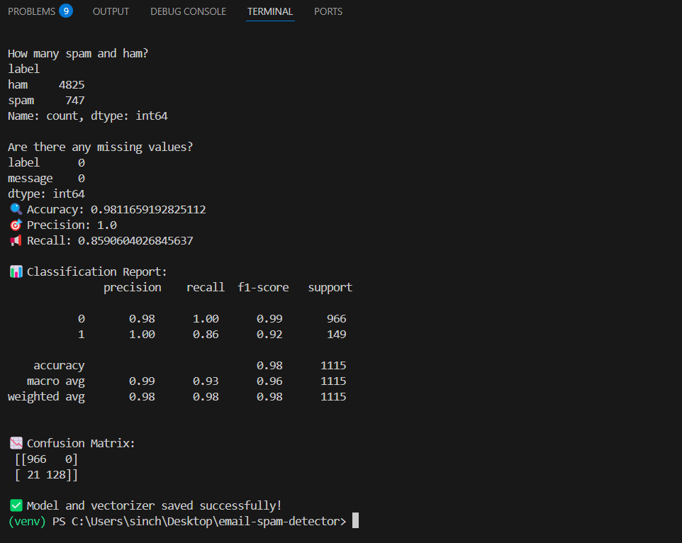

# 📧 Email Spam Detection - Machine Learning Project



Detects spam emails using a Naive Bayes classifier with 98% accuracy.

## How it works:
- Cleans and processes email text (lowercase, remove stopwords)
- Converts text to numbers using TF-IDF
- Trains a model using Naive Bayes

## Files:
- `spam_detector.py` – Main Python file
- `spam_classifier_model.pkl` – Trained model
- `tfidf_vectorizer.pkl` – Saved TF-IDF vectorizer

## How to run:
```bash
python spam_detector.py
